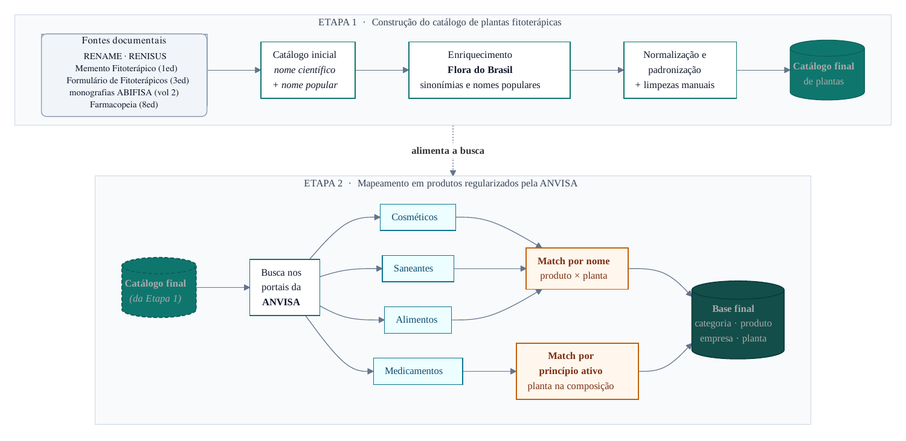

# Plantas e produtos registrados na Anvisa

Códigos do projeto Fiocruz para relacionar plantas, produtos e empresas nos mercados de medicamentos, alimentos, cosméticos e saneantes.

## Fluxo do projeto



Catálogo de plantas → coleta na Anvisa → análise dos produtos → localização das empresas → mapas.

## Códigos finais

| Arquivo | Função |
| --- | --- |
| `Codigos/coletar_medicamentos_principio_ativo.py` | Busca medicamentos por princípio ativo, com retomada e revisão automática de pendências. |
| `Codigos/coletar_produtos_por_nome_v43.ipynb` | Registro da coleta por nome. |
| `Codigos/analisar_medicamentos.R` | Consolida medicamentos e gera bases e gráficos. |
| `Codigos/analisar_produtos_por_nome.R` | Analisa alimentos, cosméticos e saneantes da planilha final. |
| `Codigos/gerar_infograficos.R` | Produz infográficos de medicamentos. |
| `Codigos/preparar_nomes_plantas.R` | Prepara uma nova lista botânica, quando necessário. |
| `Codigos - Mapas/preparar_empresas_medicamentos.R` | Prepara a localização das empresas de medicamentos. |
| `Codigos - Mapas/preparar_empresas_produtos_por_nome.R` | Prepara a localização das empresas dos demais mercados. |
| `Codigos - Mapas/gerar_mapas_mercados_e_territorios.R` | Gera mapas gerais por mercado e recortes das regiões de interesse. |

`funcoes_analise.R` e `graficos_medicamentos.R` são auxiliares chamados pelas análises.

## Dados e execução

O pacote reúne códigos finais, mapas HTML, CSVs e insumos de apoio. **Relatórios, figuras exportadas e os downloads brutos da Anvisa não acompanham esta distribuição.**

- `Codigos/dados/plantas_busca.csv`: entrada do coletor de medicamentos.
- `Codigos/dados/produtos_por_nome_anvisa.xlsx`: resultado final da coleta por nome, necessário à sua análise.
- `Codigos/ResultadosFinal/Bases/` e `Codigos - Mapas/Data/`: bases consolidadas e apoio aos mapas.
- `Codigos - Mapas/config/`: catálogo de espécies e regras de associação.

Os HTMLs podem ser consultados sem executar os códigos. Para refazer a análise de medicamentos, é necessário obter a coleta completa em `Codigos/Downloads/`, incluindo os arquivos Excel e `progresso_anvisa.csv`.

**Coleta — Python 3.10+, Linux ou macOS:**

```bash
pip install -r requirements.txt
python -m playwright install --with-deps chromium
python Codigos/coletar_medicamentos_principio_ativo.py
```

O coletor grava em `Codigos/Downloads/`. Repetir o comando retoma a coleta; para uma coleta nova, use uma pasta vazia com `--saida`. O acesso real depende da disponibilidade e das restrições da Anvisa.

**Análises e mapas — execute na raiz do projeto, com os insumos disponíveis:**

```bash
Rscript instalar_pacotes.R
Rscript Codigos/analisar_medicamentos.R
Rscript Codigos/analisar_produtos_por_nome.R
Rscript Codigos/gerar_infograficos.R
Rscript "Codigos - Mapas/preparar_empresas_medicamentos.R"
Rscript "Codigos - Mapas/preparar_empresas_produtos_por_nome.R"
Rscript "Codigos - Mapas/gerar_mapas_mercados_e_territorios.R"
```

Após uma nova coleta, atualize as bases e regenere os resultados antes de substituir os arquivos publicados. A instalação de pacotes geográficos do R pode exigir dependências do sistema.
